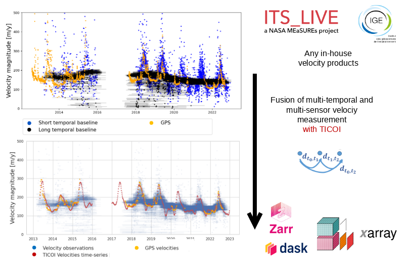

# TICOI
[](https://www.python.org/)
[](https://github.com/ticoi/ticoi/actions/workflows/python-app.yml)
[](https://github.com/ticoi/ticoi/LICENSE)


Post-processing method based on the temporal closure to fuse multi-temporal and multi-sensor velocity measurements,
which may have been computed from  different processing chains.

If you use this package, please cite:

Charrier, L., Dehecq, A., Guo, L., Brun, F., Millan, R., Lioret, N., ... & Halas, P. (2025). TICOI: an operational Python package to generate regularized glacier velocity time series. EGUsphere, 2025, 1-40.


## Get started

### INSTALLATION

To clone the git repository and set up the conda environment:

```
git clone git@github.com:ticoi/ticoi.git
cd ticoi/
conda env create -f ticoi_env.yml -n env_ticoi
conda activate ticoi
pip install -e .
```

*Note:* To be speed-up the environment setup, you may use mamba. Simply run before the previous lines:

```
conda install mamba -n base -c conda-forge
conda activate base
```

Then replace all conda commands by mamba.

### STRUCTURE

#### Main code

* **core.py**: Main functions to process the temporal inversion of glacier's surface velocity using
  the TICOI method. The inversion is solved using an Iterative Reweighted Least Square, and a robust downweighted
  function (Tukey's biweight).
* **cube_data_classxr.py**: Class object to store and manipulate velocity observation data in a cube (netcdf or zarr)
* **pixel_class.py**: Class object to manipulate and visualize velocity observations and inverted results on a pixel (from a pandas dataframe, or inside a cube)
* **inversion_functions.py**: Functions to process the temporal inversion.
* **interpolation_functions.py**: Functions to process the temporal interpolation.
* **filtering_functions.py**: Functions to process some filtering.
* **utils.py**: Two other functions for accessing ITS_LIVE data.
* **mjd2date.py**: Functions to convert the dates from Modified Julian Date to Gregorian Date

#### Basic examples

**- notebook**
* **examples/basic/notebook/pixel_demo_its_live_on_cloud.ipynb**: Demonstration of how to process one pixel of a NetCDF file
* **examples/basic/notebook/pixel_demo_local_ncdata.ipynb**: Demonstration of how to process one pixel of ITS_LIVE data, stored on a cloud

**- python_script**
* **examples/basic/python_script/ticoi_cube_demo.py**: Demonstration of how to process one cube
* **examples/basic/python_script/ticoi_pixel_demo.py**: Demonstration of how to process one pixel


#### More advanced examples

* **cube_ticoi_demo_its_live.py**: Demonstration of how to process one ITS_LIVE cube directly from the cloud
* **examples/advances_processing/cube_ticoi_demo_advanced.py**: Demonstration of how to process one cube, by using different parameters for different areas (stable, surge)
* **examples/data_availability.py**: A few tools to evaluate the data availability on a set of data, its repartition throughout the period of measurement and its quality
in some cases, in order to see whether it is relevant or not to study glacier velocities at a point (seaonality, surge...). It uses
TICOI's optimized loading to load the data.
* **examples/optimize_coef/pixel_optimize_coef_nvcc.py**: Demonstration of how to choose the regularisation parameter according to the Vector Velocity Coherence

### TO START

#### You have geotiff files
You need to convert them into netcdf, for that have a look at advanced_processing/geotiff_to_xarray.py

#### You have netcdf files
If it is ITS_LIVE data, or Millan et al., 2019, you can directly use them!
If not, you have to create your own dataloader, within which the dimension should be ("mid_date", "y", "x"), and the variables should be "vx", "vy", and should contain the projection information in the ds.proj4 attribute.

### OUTPUTS
* to understand to output of pixel_demo please check README_visualization_pixel_output.md


<p align="center">
  
</p>

[packaging guide]: https://packaging.python.org

[distribution tutorial]: https://packaging.python.org/tutorials/packaging-projects/

[src]: https://github.com/pypa/sampleproject

[rst]: http://docutils.sourceforge.net/rst.html

[md]: https://tools.ietf.org/html/rfc7764#section-3.5 "CommonMark variant"

[md use]: https://packaging.python.org/specifications/core-metadata/#description-content-type-optional
