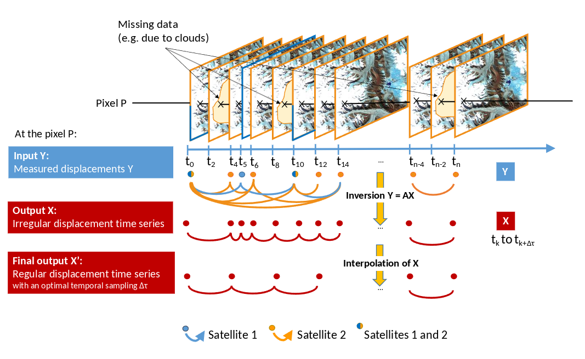

# TICOI

[](https://www.python.org/)
[](https://github.com/ticoi/ticoi/actions/workflows/python-app.yml)
[](https://github.com/ticoi/ticoi/blob/main/LICENSE)
[](https://github.com/pypa/hatch)
[](https://github.com/astral-sh/ruff)

Post-processing method based on the temporal closure to fuse multi-temporal and multi-sensor velocity measurements,
which may have been computed from different processing chains.

The package is based on the methodological developments published in:

Charrier, L., Dehecq, A., Guo, L., Brun, F., Millan, R., Lioret, N., ... & Halas, P. (2025). TICOI: an operational
Python package to generate regular glacier velocity time series. EGUsphere, 2025, 1-40.

Charrier, L., Yan, Y., Koeniguer, E. C., Leinss, S., & Trouvé, E. (2021). Extraction of velocity time series with an
optimal temporal sampling from displacement observation networks. IEEE Transactions on Geoscience and Remote Sensing,
60, 1-10.

The main principle of TICOI relies on the temporal closure of the displacement measurement network.
Measured displacements with different temporal baselines are expressed as linear combinations of estimated
displacement (see the Figure below).
The aim is to take advantage of different types of information (displacement measured using different temporal
baselines,
on images from different types of satellite) to extract glacier velocity time series, with a given temporal sampling.
This package enable the
harmonization of various datasets, and the creation of standardized sub-annual velocity products.

<p align="center">
  
</p>

## INSTALLATION

### With `mamba`

Clone the git repo and create a `mamba` environment (see how to install `mamba` in
the [mamba documentation](https://mamba.readthedocs.io/en/latest/)):

```bash
git clone git@github.com:ticoi/ticoi.git
cd ticoi
mamba env create -f environment.yml  # Add '-n custom_name' if you want.
mamba activate environment  # Or any other name specified above
```

### With `pip`

```bash
python3.10 -m venv ticoi-env
source ticoi-env/bin/activate
pip install git+https://github.com/ticoi/ticoi.git
```

## TUTORIALS

### Basic examples

**- notebook**

* [How to process one pixel of a NetCDF file](/home/charriel/Documents/Scripts_dossier/ticoi_lch/examples/basic/notebook/pixel_demo_local_ncdata.ipynb)
* [How to process one pixel of ITS_LIVE data, stored on a cloud](/home/charriel/Documents/Scripts_dossier/ticoi_lch/examples/basic/notebook/pixel_demo_its_live_on_cloud.ipynb)

**- python_script**

* [How to process one cube](/home/charriel/Documents/Scripts_dossier/ticoi_lch/examples/basic/python_script/cube_ticoi_demo.py)
* [How to process one pixel](/home/charriel/Documents/Scripts_dossier/ticoi_lch/examples/basic/python_script/pixel_ticoi_demo.py)

### Advanced examples

* [How to process one ITS_LIVE cube directly from the cloud](/home/charriel/Documents/Scripts_dossier/ticoi_lch/examples/advanced/cube_ticoi_demo_its_live.py)
* [How to format several geotiff files into a netCDF file](/home/charriel/Documents/Scripts_dossier/ticoi_lch/examples/advanced/cube_prep_from_geotiff.py)
* [How to apply GLAFT on TICOI results](/home/charriel/Documents/Scripts_dossier/ticoi_lch/examples/advanced/glaft_for_ticoi_results.py)

## TO USE YOUR ONE DATASET

### You have geotiff files

You need to convert them into netcdf, by
modified [this script](/home/charriel/Documents/Scripts_dossier/ticoi_lch/examples/advanced/cube_prep_from_geotiff.py).

### You have netcdf files

If it is ITS_LIVE data, or Millan et al., 2019, you can directly use them!
If not, you have to create your own dataloader, within which the dimension should be ("mid_date", "y", "x"), and the
variables should be "vx", "vy", and should contain the projection information in the ds.proj4 attribute.

## HYPERPARAMETERS AND OUTPUTS

* to understand to output of pixel_demo please
  check [README_output](/home/charriel/Documents/Scripts_dossier/ticoi_lch/README_output.md)
* to understand the parameters you can change, please
  check [README_possible_parameters](/home/charriel/Documents/Scripts_dossier/ticoi_lch/README_possible_parameters.md)


## TO CONTRIBUTE

If you have an idea to improve this package, you are welcome to contribute! See guidelines [here](/home/charriel/Documents/Scripts_dossier/ticoi_lch/CONTRIBUTING.md). 

[packaging guide]: https://packaging.python.org

[distribution tutorial]: https://packaging.python.org/tutorials/packaging-projects/

[src]: https://github.com/pypa/sampleproject

[rst]: http://docutils.sourceforge.net/rst.html

[md]: https://tools.ietf.org/html/rfc7764#section-3.5 "CommonMark variant"

[md use]: https://packaging.python.org/specifications/core-metadata/#description-content-type-optional
